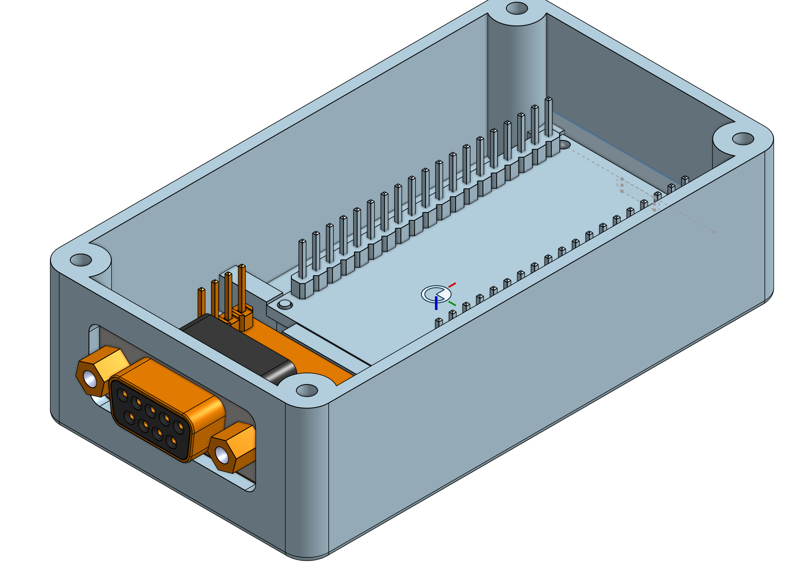

# p4_micropython

Small Python script to convert Fröling P4 serial data (RS232) to Prometheus metrics on an ESP32 MicroPython board

## 3D Printing Supplies

To install this project permanently on a Fröling heating system, I designed a small enclosure for 3D printing.
Please find files below for importing into your own slicer or a pre-made profile for a Bambu Lab A1 mini.
Everything was designed in OnShape: https://cad.onshape.com/documents/abe36679b3c32f409a93e3e0/w/f37b6a48e71b542d70116c3e/e/b84ccace9968d596acb20eb4 

| File          | Description |
| ------------- | ------------- |
| [ESP32_Case_Boden.step](3dprint/ESP32_Case_Boden.step)  | Base for enclosure  |
| [ESP32_Case_Deckel.step](3dprint/ESP32_Case_Deckel.step)  | Lid for enclosure |
| [ESP32_Case.3mf](3dprint/ESP32_Case.3mf)| Bambu Lab A1 mini print profile|
